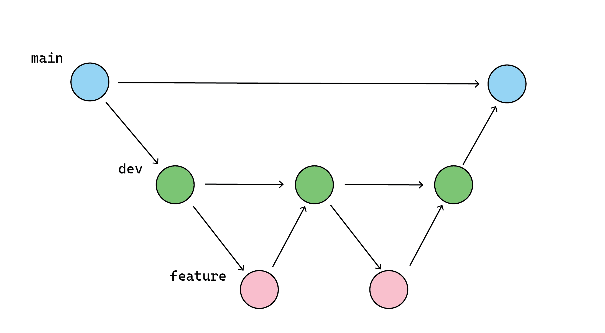
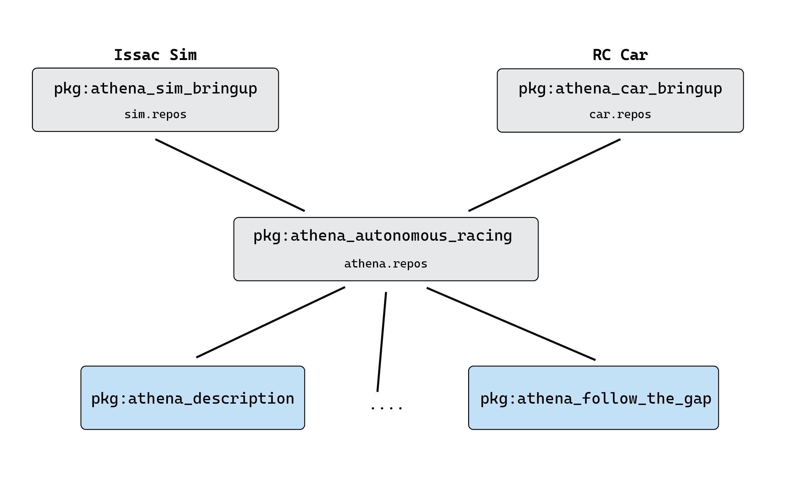
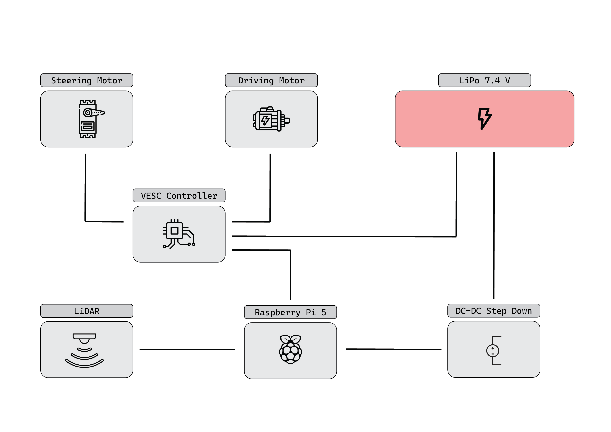

# Athena Documentation

This repository contains the documentation for the Athena project, covering its setup, codebase, and development workflow. It provides a high-level overview of the system, the components it uses, and the development and deployment process.

For more detailed documentation, see the Notion workspace.

## Contents

- [Branching Model](#branching-model)
- [High-Level Stack Overview](#high-level-stack-overview)
- [Software Stack Overview](#software-stack-overview)
- [Simulation Stack Overview](#simulation-stack-overview)
- [Hardware Overview](#hardware-overview)

## Branching Model

The branching model is straightforward and consists of three types of branches:

- **main**: contains the code that is currently deployed.
- **dev**: the integration branch, where features are tested and evaluated before being merged into `main`.
- **feature branches**: where individual features are developed and tested before being merged into `dev`.

The diagram below illustrates this workflow:

# High-Level Stack Overview

The stack consists of two main repositories:

- **athena-race-stack** runs on the real car
- **athena-simulation-isaac-sim** is used to develop new algorithms and test them in simulation

Neither is a ROS package itself. Both define their environment (containers, setup scripts) and pull the required packages via `vcs import`. The shared autonomy packages are listed in a common `athena.repos` (hosted in `athena_autonomous_racing`); each main repo adds its own platform-specific `.repos` file (e.g. drivers for the car, simulation bridge for Isaac Sim).

### Launch structure

- **athena_autonomous_racing** is platform-agnostic. It launches only the autonomy
  modules (localization, perception, planning, control), each via the module's own
  launch file and default parameters.
- **Platform bringup packages** (`athena_car_bringup`, `athena_sim_bringup`) start the
  platform-specific parts (hardware drivers or simulation interface), include the
  autonomy launch file and pass a platform-specific parameter override file.

This works because both platforms follow the same interface contract: identical
topic names, message types and TF frames, regardless of whether data comes from
real sensors or the simulation.

### Development vs. deployment on the car

- **Development:** The workspace is mounted from the host into the container.
  Code and parameter changes persist and can be committed and pushed directly.
- **Deployment:** The image contains all packages at pinned versions
  (frozen via `vcs export --exact`). Nothing is changed at runtime, so every race
  run is reproducible.

# Software Stack Overview

Todo: Add a diagram of the software stack and describe the components.

# Simulation Stack Overview

Todo: Add a diagram of the simulation stack and describe the components.

# Hardware Overview 

### Radio-controlled (RC) Car aka Chassis

The vehicle platform selected for this project is the Absima ATC 3.4 V2, which includes a radio control system and is delivered in a ready-to-race (RTR) configuration. The vehicle is equipped with two motors: a brushless motor for propulsion and a servo motor for steering.
The brushless motor has a 3,300 KV rating and a 540-size design. It provides propulsion to all four wheels, making the vehicle an all-wheel-drive platform.
The vehicle uses mechanically implemented Ackermann steering and features an open differential on both the front and rear axles. There is no center differential between the front and rear axles. As a result, the wheels on each axle can rotate at different speeds, while the front and rear axles remain mechanically connected.
For operation, the vehicle requires a 7.4 V lithium-polymer (LiPo) battery with a capacity of 4,000 mAh. The battery consists of two cells connected in series (2S). To enable continuous operation without interrupting the development and testing process, a second battery was purchased so that one battery can be used while the other is being charged.

### Raspberry Pi
The Raspberry Pi 5 is the main onboard computer used for autonomous driving operations in this project. It is a compact single-board computer that provides the processing power required to run the vehicle's software and process sensor data.
The Raspberry Pi 5 has an average power consumption of approximately 12 W, 16 GB of RAM, and a processor clock speed of up to 2.4 GHz.
For interfacing with other hardware components, it provides a 40-pin GPIO header, including 26 GPIO pins, as well as four USB ports.

### LiDAR
The STL-19P LiDAR sensor from LDROBOT, also available as the D500 from Waveshare, is used for distance measurement and environmental perception on the vehicle.
The sensor has a maximum detection range of 12 meters and operates at a scanning frequency of 6–13 Hz. Its ranging frequency is 5,000 Hz. It uses Time-of-Flight (ToF) technology to determine distances by measuring the time required for a laser pulse to travel to an object and return to the sensor.
Communication with the LiDAR is handled via a Universal Asynchronous Receiver/Transmitter (UART) interface. An additional adapter allows the sensor to be connected directly to the Raspberry Pi via USB, providing a simple plug-and-play setup.

### 25W DC-DC Step-Down Converter
To provide a reliable mobile power supply for the Raspberry Pi, the vehicle is equipped with a 7.4 V lithium-polymer (LiPo) battery with a capacity of 4,000 mAh.
Since the Raspberry Pi requires a stable 5 V input voltage, a DC-DC step-down converter is used to reduce the battery voltage to the required level. The converter regulates the output voltage and provides a consistent power supply to the Raspberry Pi, helping to prevent voltage fluctuations that could affect the stability of the system.

### VESC Controller
To control the vehicle's actuators, such as the brushless motor and the steering servo, a VESC controller is used. The vehicle is equipped with a modified version of the VESC® 6 MKVI Speed Controller from Trampa. The VESC is powered directly by the 7.4 V lithium-polymer (LiPo) battery.
The brushless motor is connected directly to the VESC through the three motor phase wires (A=yellow, B=blue, and C=red). The steering servo is connected to the VESC via the PPM interface.
The Raspberry Pi communicates with the VESC via Micro-USB and sends the required control commands. The VESC then processes these commands and controls the connected actuators accordingly. This allows the Raspberry Pi to control the vehicle without directly handling the low-level motor control.

### Camera (optional)
For the camera system, either a Raspberry Pi Camera Module 3 or an FPV camera from an old racing drone can be used. At the current stage of the project, neither camera has been integrated into the system yet.
